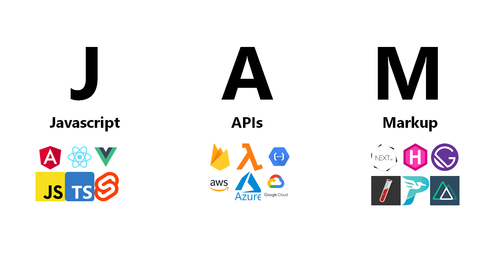

# 🚀 **What is JAMstack?** 🌟

JAMstack is a modern approach to building web applications and static sites that offers exceptional performance, security, and scalability. The term JAMstack stands for three core principles:

- **J**avaScript
- **A**PIs
- **M**arkup

## 💡 **How Does JAMstack Work?**

1. **JavaScript**: Interactive frontends are built using JavaScript, which can interact with APIs to fetch data and perform dynamic operations.

2. **APIs**: Instead of having a monolithic backend server, JAMstack leverages external APIs to handle business logic, authentication, data storage, and more. This makes your application more modular and scalable.

3. **Markup**: JAMstack sites are typically served as static pages (HTML). These pages are generated during the build process and served quickly to users.

## 🔥 **What is Serverless?** 🚀

Serverless is a cloud computing model where you don't manage servers. Instead, you pay only for specific functions that execute in response to events.

### **Advantages of Serverless:**

- **Automatic Scalability**: Functions scale automatically based on demand.
- **Cost Efficiency**: You pay only for the execution time of your functions, not for idle servers.
- **Less Maintenance**: No need to worry about server infrastructure maintenance.

## 🌐 **What is API-less Architecture?** 🤔

API-less architecture focuses on building applications without directly interacting with APIs for every piece of functionality. Instead, it may rely on static data or built-in functions and services. This can simplify development and reduce dependencies on external systems.

### **Benefits of API-less Architecture:**

- **Simpler Development**: Fewer dependencies and reduced complexity.
- **Faster Execution**: Eliminates the need for API calls, which can speed up performance.
- **Reduced Costs**: Fewer external services may mean lower operational costs.

## 🎉 **How Do JAMstack and Serverless Relate?**

JAMstack and Serverless complement each other perfectly. While JAMstack focuses on a modern, fast frontend architecture, Serverless handles backend logic seamlessly without the need for server management. Together, they provide a robust and efficient solution for building web applications and sites.

## 🛠️ **Useful Resources:**

- [JAMstack Documentation](https://jamstack.org/docs/)
- [AWS Serverless Guide](https://aws.amazon.com/serverless/)
- [Netlify](https://www.netlify.com/) for JAMstack deployment and serverless functions
- [BYLICMS](https://www.byli.dev/) for JAMstack deployment with serverless and api-less functions !

## 🌟 **Conclusion**

JAMstack and Serverless are revolutionizing web development by offering a faster, more secure, and efficient way to build applications and websites. With the combination of JavaScript, APIs, and Markup, along with the power of Serverless and the flexibility of API-less architecture, you can create amazing web experiences without worrying about infrastructure.

Explore these technologies and take your projects to the next level! 🚀🌟
